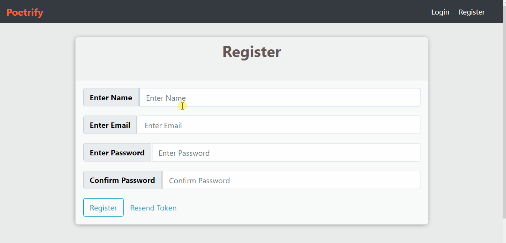
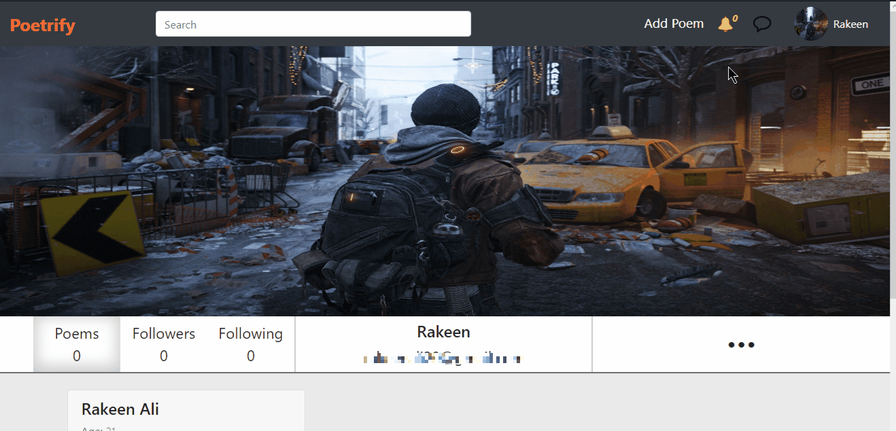
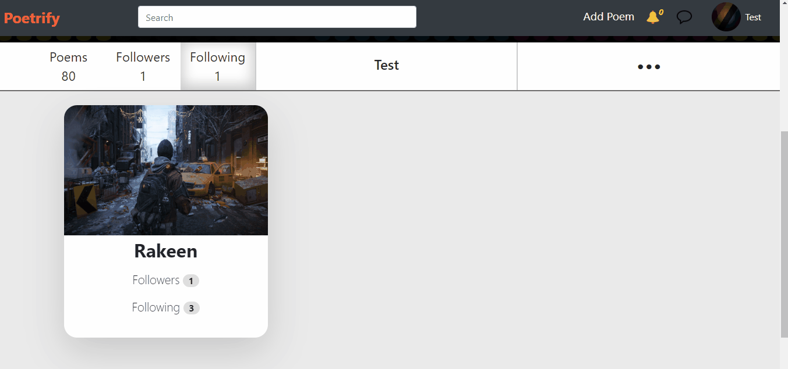
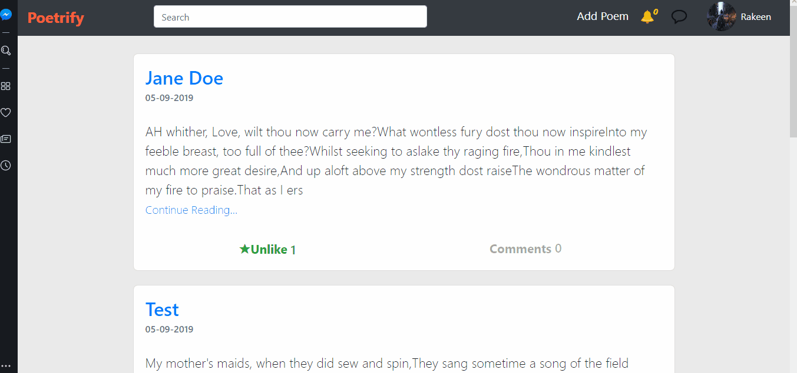

# Poetrfy

BS-CS Final Year Project

## Description
Poetrify is final year project developed especially for Poets where they can upload their poems chat with other poets and can create groups realted to their likings.

## Development
Development of Poetrify is done by using MERN stack.


### Backend
Backedn API is powered by Nodejs, Expressjs, MongodDb, Socket.io, node-tfidf

### Frontend
Frontend SPA is powered by React, Redux, Socket-io-client.

## Functionalities
1. User can Login / Register (In order to regsiter user has to verify his/her email)
2. User can create profile
3. User can add/delete/update poems
4. User can comment or like a poem 
5. User can follow other users.
6. Whenever user created a new poem notification is send to all his followers with the link to the newly created poem
7. User can create groups and can add other users to that group
8. User can also Chat with other users in realtime by following them first
9. User will get recomendation of poems based upon his or her liking a poem or comment on a certain poem

## Demo

#### Login / Register


#### Add Poem, Like / Comment


#### Follow / Unfolow


#### Notification, Chat App


#### Groups


#### Recomendation System



## How To

```shell
# Clone the repo
git clone git@github.com:rakeenali/Poetrify.git

# cd into the cloned repo
cd Poetrify

# install all the dependencies
npm install
cd client && npm install
```

```shell
# Runing the app
# in the main folder Poetrify
npm run server
npm run client
```
